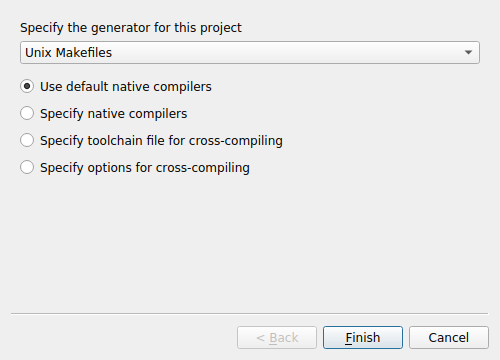

# Build from source - Linux

## Requirements

1. A C/C++ compiler.
2. [CMake](https://cmake.org/download/), e.g. version 3.20 or higher.
3. [OpenCL](../opencl_installation.md).

## Source compilation

In a terminal, install a compiler and all essential libraries for source compilation.

```
sudo apt update
sudo apt install build-essential
```

Download and install [CMake](https://cmake.org/download/) and if not their already, add it to your system **PATH**


In the source directory, you can then use CMake to configure and build the sources
```
cmake -S . -B ./build
cmake --build ./build
```

##### CMake GUI (Alternative) 

Alternatively you can use CMake GUI for a more user-friendly project configuration.

Start CMake and configure the **source directory (1)**. Create a "build" directory as sub-folder and select it as **build directory (2)**:


In the CMAKE_BUILD_TYPE line, wither "Release" to configure a release build type.

Then run the configuration by clicking on **Configure (3)**, and choose "Unix Makefile":


Click on **Generate (4)** and afterwards open the build directory and run the command `make` in a terminal to compile the whole project.

## Installation

**WIP**